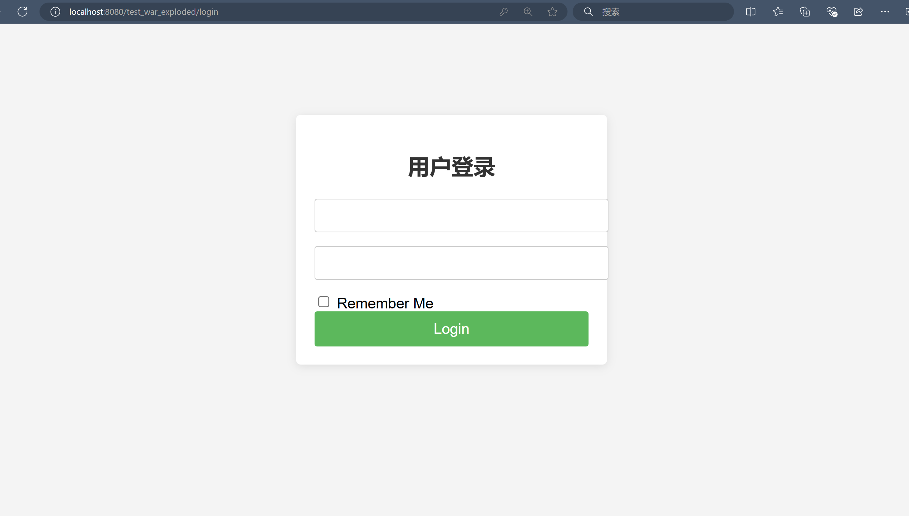

# 作业二：Filter练习

学院：省级示范性软件学院
题目：《 作业一：Filter练习》
姓名：罗云平
学号：2200770266
班级：软工2202
日期：2024-10-4

### 一、大体思路

1. 创建LoginFilter通过Session来跟着用户的登录状态，同时使用Cookie保持用户的登录状态（eg:“记住我”功能）

2. 设计登陆页面,主页面`login.jsp`,`home.jsp`

3. 设计登出功能，用户点击“退出”时，清除`Session`,`Cookie`

4. `doFilter`中实现逻辑：

   a.对登录页面、注册页面或公共资源的请求放行

   b.判断用户是否登录并设计相应功能

### 二、代码实现

- 创建LoginFilter

  在创建过滤器类 `LoginFilter.java`：

  ```java
  package com.itheima.test;
  
  import jakarta.servlet.*;
  import jakarta.servlet.annotation.WebFilter;
  import jakarta.servlet.http.HttpServletRequest;
  import jakarta.servlet.http.HttpServletResponse;
  import jakarta.servlet.http.HttpSession;
  
  import java.io.IOException;
  import java.util.Arrays;
  import java.util.List;
  
  /**
   * 登录验证的过滤器
   */
  @WebFilter("/*")
  public class LoginFilter implements Filter {
      private static final List<String> EXCLUDED_PATHS = Arrays.asList(
              "login.jsp", "register.jsp", "public", "style.css", "home.jsp"
      );
      private static final String USER_ID_COOKIE_NAME = "userId";
  
      @Override
      public void doFilter(ServletRequest servletRequest, ServletResponse servletResponse, FilterChain filterChain) throws IOException, ServletException {
          HttpServletRequest request = (HttpServletRequest) servletRequest;
          HttpServletResponse response = (HttpServletResponse) servletResponse;
  
          String requestURI = request.getRequestURI();
  
          // 检查请求路径是否在排除列表
          if (isExcludedPath(requestURI)) {
              filterChain.doFilter(request, response);
              return;
          }
  
          HttpSession session = request.getSession(false); // 不创建新session
          Object user = (session != null) ? session.getAttribute("user") : null;
  
          // 如果用户已登录，放行请求
          if (user != null) {
              filterChain.doFilter(servletRequest, servletResponse);
          } else {
              // 检查cookie中是否有用户ID
              String userID = getUserIdFromCookie(request);
              if (userID != null) {
                  // 登录成功，设置session
                  session = request.getSession(true);
                  session.setAttribute("user", userID);
                  filterChain.doFilter(servletRequest, servletResponse);
              } else {
                  // 用户未登录，跳转到登录页面
                  request.setAttribute("login_msg", "您尚未登录！");
                  request.getRequestDispatcher("/login.jsp").forward(request, servletResponse);
              }
          }
      }
  
      private boolean isExcludedPath(String requestURI) {
          return EXCLUDED_PATHS.stream().anyMatch(requestURI::endsWith);
      }
  
      private String getUserIdFromCookie(HttpServletRequest request) {
          // 处理可能为null的cookie数组
          if (request.getCookies() == null) {
              return null;
          }
          return Arrays.stream(request.getCookies())
                  .filter(cookie -> USER_ID_COOKIE_NAME.equals(cookie.getName()))
                  .map(cookie -> cookie.getValue())
                  .findFirst()
                  .orElse(null);
      }
  
      @Override
      public void init(FilterConfig filterConfig) throws ServletException {
          // 初始化逻辑（如果需要）
      }
  
      @Override
      public void destroy() {
          // 清理资源（如果需要）
      }
  }
  ```

  

- 创建登录页面

  在 `src/main/webapp` 目录下创建 `login.jsp` 页面：

  ```java
  <%@ page language="java" contentType="text/html; charset=UTF-8" pageEncoding="UTF-8"%>
  
  <!DOCTYPE html>
  <html lang="zh">
  <head>
      <meta charset="UTF-8">
      <title>用户登录</title>
      <link rel="stylesheet" href="style.css">
  </head>
  <body>
  <div class="login-container">
      <h2>用户登录</h2>
      <form action="login" method="post">
          <input type="text" name="username" required>
          <input type="password" name="password" required>
          <input type="checkbox" name="rememberMe"> Remember Me
          <button type="submit">Login</button>
      </form>
  
  
  </div>
  </body>
  </html>
  ```
  
  
  
- 创建主页面

  在 `src/main/webapp` 目录下创建 `home.jsp` 页面：

  ```java
  <%@ page contentType="text/html;charset=UTF-8" language="java" %>
  <!DOCTYPE html>
  <html lang="zh">
  <head>
    <meta charset="UTF-8">
    <title>主页</title>
    <link rel="stylesheet" href="style.css"> <!-- 链接到CSS文件 -->
  </head>
  <body>
  <%
    String username = (String) session.getAttribute("user"); // 从会话获取用户名
  %>
  <h1>欢迎, <%= username != null ? username : "游客" %>!</h1> <!-- 显示用户名，如未登录则显示“游客” -->
  <a href="logout">退出</a> <!-- 注销链接 -->
  </body>
  </html>
  ```

  

- 实现了一个会话检查的过滤器`AuthFilter`:

  - 可以确保只有经过认证的用户才能访问受保护的资源。如果用户未登录，则会被重定向至登录页面。这样可以有效防止未授权访问，提高应用的安全性。

  ```java
  package com.itheima.test;
  
  import jakarta.servlet.*;
  import jakarta.servlet.annotation.WebFilter;
  import jakarta.servlet.http.HttpServletRequest;
  import jakarta.servlet.http.HttpServletResponse;
  import jakarta.servlet.http.HttpSession;
  
  import java.io.IOException;
  
  
  @WebFilter("/*") // 拦截所有请求
  public class AuthFilter implements Filter {
      public void doFilter(ServletRequest request, ServletResponse response, FilterChain chain)
              throws IOException, ServletException {
          HttpServletRequest httpRequest = (HttpServletRequest) request;
          HttpServletResponse httpResponse = (HttpServletResponse) response;
  
          HttpSession session = httpRequest.getSession(false);
          String loginURI = httpRequest.getContextPath() + "/login.jsp"; // 登录页面的路径
  
          boolean loggedIn = (session != null && session.getAttribute("user") != null);
          boolean loginRequest = httpRequest.getRequestURI().equals(loginURI);
  
          // 如果已登录或请求的是登录页面，则继续处理请求
          if (loggedIn || loginRequest) {
              chain.doFilter(request, response); // 继续请求
          } else {
              httpResponse.sendRedirect(loginURI); // 重定向到登录页面
          }
      }
  
      // 其他方法 (init和destroy) 可以根据需要实现
  }
  ```

  

- 处理登录请求

  创建一个 Servlet 来处理登录逻辑 `LoginServlet.java`

  ```java
  package com.itheima.test;
  
  import jakarta.servlet.ServletException;
  import jakarta.servlet.annotation.WebServlet;
  import jakarta.servlet.http.Cookie;
  import jakarta.servlet.http.HttpServlet;
  import jakarta.servlet.http.HttpServletRequest;
  import jakarta.servlet.http.HttpServletResponse;
  import jakarta.servlet.http.HttpSession;
  
  import java.io.IOException;
  
  @WebServlet("/login")
  public class LoginServlet extends HttpServlet {
      @Override
      protected void doGet(HttpServletRequest request, HttpServletResponse response) throws ServletException, IOException {
          try {
              System.out.println("doGet called");
              request.getRequestDispatcher("/login.jsp").forward(request, response);
          } catch (Exception e) {
              e.printStackTrace(); // 打印异常信息
          }
      }
  
      @Override
      protected void doPost(HttpServletRequest request, HttpServletResponse response) throws ServletException, IOException {
          System.out.println("doPost called");
  
          String username = request.getParameter("username");
          String password = request.getParameter("password");
  
          if ("admin".equals(username) && "123456".equals(password)) {
              HttpSession session = request.getSession(true);
              session.setAttribute("user", username);
  
              if ("on".equals(request.getParameter("rememberMe"))) {
                  Cookie cookie = new Cookie("userId", username);
                  cookie.setMaxAge(7 * 24 * 60 * 60);
                  cookie.setPath("/");
                  cookie.setHttpOnly(true); // 增强安全性
                  response.addCookie(cookie);
              }
  
              response.sendRedirect("home.jsp");
          } else {
              request.setAttribute("error_msg", "用户名或密码错误");
              request.getRequestDispatcher("/login.jsp").forward(request, response);
          }
      }
  }
  ```

  

- 处理登出请求

  创建一个 Servlet 来处理登录逻辑 `LogoutServlet.java`

  ```java
  package com.itheima.test;
  
  import jakarta.servlet.ServletException;
  import jakarta.servlet.annotation.WebServlet;
  import jakarta.servlet.http.HttpServlet;
  import jakarta.servlet.http.HttpServletRequest;
  import jakarta.servlet.http.HttpServletResponse;
  import jakarta.servlet.http.HttpSession;
  
  import java.io.IOException;
  
  @WebServlet("/logout")
  public class LogoutServlet extends HttpServlet {
      @Override
      protected void doGet(HttpServletRequest request, HttpServletResponse response) throws ServletException, IOException {
          HttpSession session = request.getSession(false);
          if (session != null) {
              session.invalidate(); // 使会话失效
          }
          response.sendRedirect("login.jsp"); // 注销后重定向到登录页面
      }
  }
  ```
  
  - 配置`web.xml`使得`AuthFilter` 和 `LoginFilter` 不会自动产生冲突
  
    ```xml
    <filter>
        <filter-name>AuthFilter</filter-name>
        <filter-class>com.demo.AuthFilter</filter-class>
    </filter>
    
    <filter>
        <filter-name>LoginFilter</filter-name>
        <filter-class>com.demo.LoginFilter</filter-class>
    </filter>
    ```
  
    ```xml
    <filter-mapping>
        <filter-name>AuthFilter</filter-name>
        <url-pattern>/*</url-pattern> <!-- 处理所有请求 -->
    </filter-mapping>
    
    <filter-mapping>
        <filter-name>LoginFilter</filter-name>
        <url-pattern>/login</url-pattern> <!-- 仅处理登录请求 -->
    </filter-mapping>
    ```
  
    - **登录页面：**
  
      
  
  ### **三**、问题与思考
  
  1. 设计过滤器的位置十分重要，一定要先想清楚放行前后的数据
  2. 还未尝试添加验证码功能，后续补充
  3. `Cookie`,`Session`都是完成一次会话内多次请求间的数据共享，需要分清楚其区别

