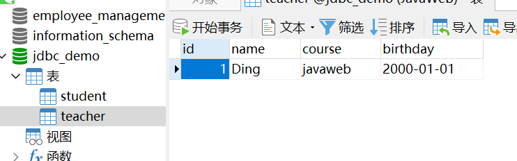
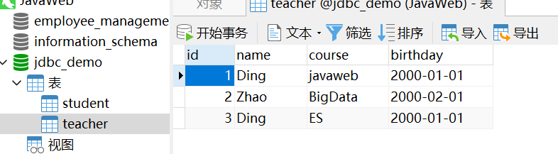
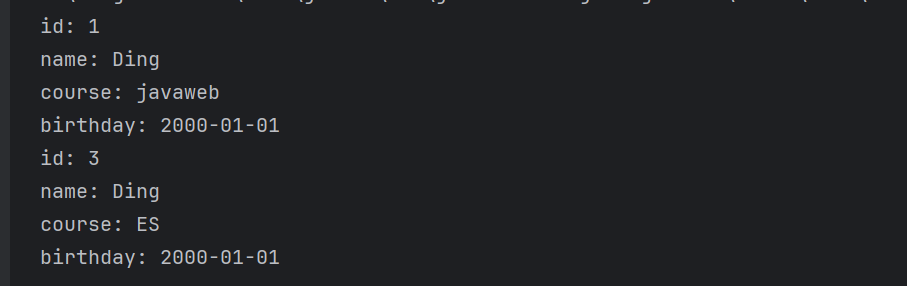
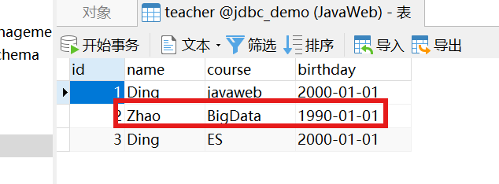
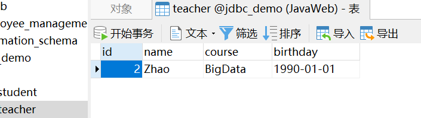
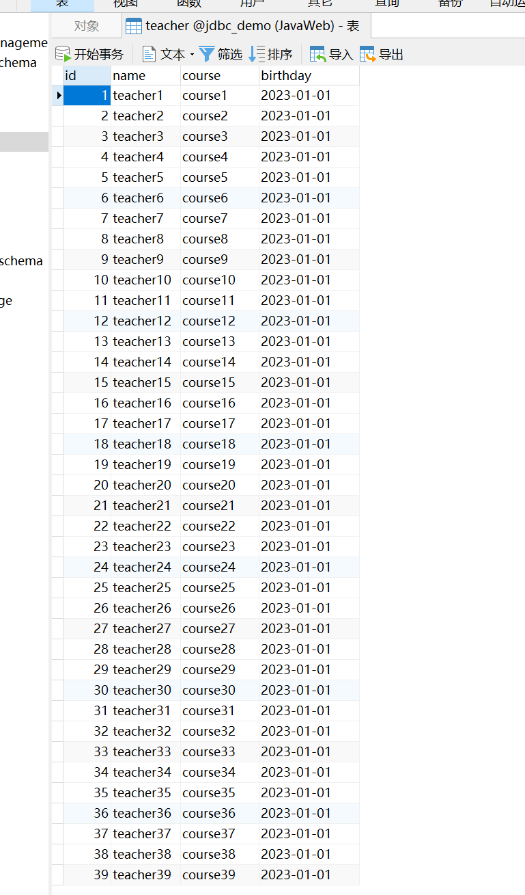
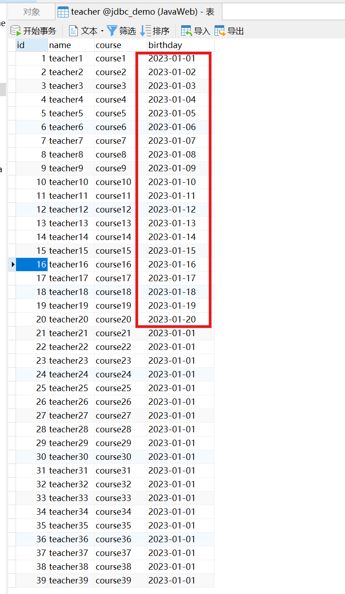
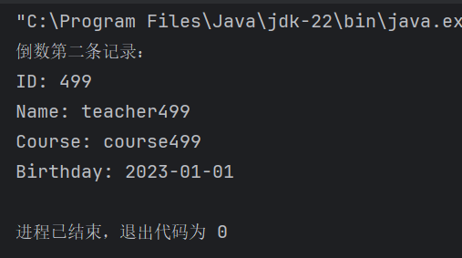
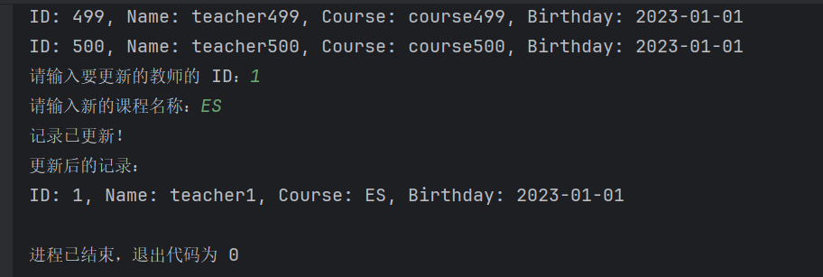
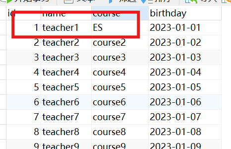

# 作业五：JDBC练习

学院：省级示范性软件学院
题目：《 作业五：JDBC练习》
姓名：罗云平
学号：2200770266
班级：软工2202
日期：2024-10-24

### 一、作业要求：

1. 完成teacher的CRUD练习，提供CRUD的代码。
2. 完成teacher表的批量插入练习，插入500个教师，每插入100条数据提交一次。
3. 完成可滚动的结果集练习，只查看结果集中倒数第2条数据。
4. 提交代码即可，但是代码中不要包含taget目录。

### 二、练习

#### **1.CRUD练习**

 1.1 Create 增

```java
package com.jdbc.jdbcdemo2;

import java.sql.*;

public class Create {

    private static final String URL = "jdbc:mysql://localhost:3306/jdbc_demo?serverTimezone=GMT&characterEncoding=UTF-8";
    private static final String USER = "root";
    private static final String PASSWORD = "123456";
    private static final String SQL = "INSERT INTO teacher(id,name,course,birthday) values(?,?,?,?);";

    public static void main(String[] args) {

        Connection conn = null;
        PreparedStatement ps = null;

        try {

            // 0.加载数据库驱动
            Class.forName("com.mysql.cj.jdbc.Driver");
            // 1.连接数据库
            conn = DriverManager.getConnection(URL, USER, PASSWORD);
            // 2.关闭自动提交，启动事务
            conn.setAutoCommit(false);
            // 3.创建预处理语句
            ps = conn.prepareStatement(SQL);
            ps.setInt(1, 1);
            ps.setString(2, "Ding");
            ps.setString(3, "javaweb");
                // 使用 java.sql.Date 设置日期
            ps.setDate(4,Date.valueOf("2000-01-01"));
            // 4.执行SQL更新
            ps.executeUpdate();
            // 5.手动提交事务
            conn.commit();
        }  catch (Exception e) {
            if(conn != null){
                try {
                    conn.rollback();
                } catch (SQLException ex) {
                    throw new RuntimeException(ex);
                }
            }
        } finally {
            if (ps != null) {
                try {
                    ps.close();
                } catch (SQLException e) {
                    throw new RuntimeException(e);
                }
            }
            if (conn != null) {
                try {
                    conn.setAutoCommit(true);
                } catch (SQLException e) {
                    throw new RuntimeException(e);
                }
                try {
                    conn.close();
                } catch (SQLException e) {
                    throw new RuntimeException(e);
                }
            }

            System.out.println("Data inserted successfully!");
        }

    }
}
```

运行结果：





 1.2 Retrieve 查

```java
package com.jdbc.jdbcdemo2;

import java.sql.*;

public class Retrieve {
    private static final String URL = "jdbc:mysql://localhost:3306/jdbc_demo?serverTimezone=GMT&characterEncoding=UTF-8";
    private static final String USER = "root";
    private static final String PASSWORD = "123456";
    private static final String SQL = "select id,name,course,birthday from teacher where name=?;";

    public static void main(String[] args) {
        Connection conn = null;
        PreparedStatement ps = null;
        ResultSet rs = null;
        try{
            //0.加载数据库驱动
            Class.forName("com.mysql.cj.jdbc.Driver");
            //1.连接数据库
            conn = DriverManager.getConnection(URL,USER,PASSWORD);
            //2.创建预处理语句
            ps = conn.prepareStatement(SQL);
            ps.setString(1,"Ding");
            //3.执行SQL语句
            rs = ps.executeQuery();
            //4.遍历查询结果
            while(rs.next()){
                System.out.println(" id: " + rs.getInt(1));
                System.out.println(" name: " + rs.getString("name"));
                System.out.println(" course: " + rs.getString("course"));
                System.out.println(" birthday: " + rs.getObject(4));
            }
        }catch (SQLException e) {
            throw new RuntimeException(e);
        } catch (RuntimeException runtimeException) {
            throw new RuntimeException(runtimeException);
        } catch (ClassNotFoundException e) {
            throw new RuntimeException(e);
        } finally {
            if (rs != null) {
                try {
                    rs.close();
                } catch (SQLException e) {
                    throw new RuntimeException(e);
                }
            }
            if (ps != null) {
                try {
                    ps.close();
                } catch (SQLException e) {
                    throw new RuntimeException(e);
                }
            }
            if (conn != null) {
                try {
                    conn.close();
                } catch (SQLException e) {
                    throw new RuntimeException(e);
                }
            }
        }

    }
}
```

运行结果：



 1.3 Update 改

```java
package com.jdbc.jdbcdemo2;

import java.sql.*;

public class Update {
    private static final String URL = "jdbc:mysql://localhost:3306/jdbc_demo?serverTimezone=GMT&characterEncoding=UTF-8";
    private static final String USER = "root";
    private static final String PASSWORD = "123456";
    private static final String SQL = "UPDATE teacher SET birthday = ? WHERE name = ?";

    public static void main(String[] args) {
        try(Connection conn = DriverManager.getConnection(URL,USER,PASSWORD);){
            conn.setAutoCommit(false);
            try(PreparedStatement ps = conn.prepareStatement(SQL)){
                //设置参数
                ps.setDate(1, Date.valueOf("1990-01-01"));
                ps.setString(2,"Zhao");
                //执行插入或更新
                ps.executeUpdate();
                conn.commit();
            } catch (SQLException e) {
                conn.rollback();
                e.printStackTrace();
            }
        } catch (SQLException e) {
            e.printStackTrace();
        }
    }
}
```

运行结果：



 1.4 Delete 删

```java
package com.jdbc.jdbcdemo2;

import java.sql.Connection;
import java.sql.DriverManager;
import java.sql.PreparedStatement;
import java.sql.SQLException;

public class Delete {
    private static final String URL = "jdbc:mysql://localhost:3306/jdbc_demo?serverTimezone=GMT&characterEncoding=UTF-8";
    private static final String USER = "root";
    private static final String PASSWORD = "123456";
    private static final String SQL = "Delete from teacher where name = ? ";

    public static void main(String[] args) {
        try(Connection conn = DriverManager.getConnection(URL,USER,PASSWORD);){
            conn.setAutoCommit(false);
            try(PreparedStatement ps = conn.prepareStatement(SQL)){
                //设置参数
                ps.setString(1,"Ding");
                //执行删除操作
                ps.executeUpdate();
                conn.commit();;
            } catch (SQLException e) {
                conn.rollback();
                e.printStackTrace();
            }
        } catch (SQLException e) {
            e.printStackTrace();
        }
    }
}
```

运行结果：



#### **2.批量操作练习**

 2.1 批量添加

```java
package com.jdbc.jdbcdemo2;

import java.sql.*;

public class BulkAdds {
    private static final String URL = "jdbc:mysql://localhost:3306/jdbc_demo?serverTimezone=GMT&characterEncoding=UTF-8";
    private static final String USER = "root";
    private static final String PASSWORD = "123456";
    private static final String SQL = "INSERT INTO teacher (id,name, course, birthday) VALUES (?,?, ?, ?)";

    public static void main(String[] args) {
        try(Connection conn = DriverManager.getConnection(URL,USER,PASSWORD);){
            conn.setAutoCommit(false);
            try(PreparedStatement ps = conn.prepareStatement(SQL)){
                //设置参数
                for (int i = 1; i <= 500; i++) {
                    //模拟数据：名字用“teacher”+i,课程用“course”+i
                    int id = i;
                    String name = "teacher" + i;
                    String course = "course" + i;
                    String birthday = "2023-01-01";
                    //设置PreparedStatement参数
                    ps.setInt(1,id);
                    ps.setString(2,name);
                    ps.setString(3,course);
                    ps.setDate(4, Date.valueOf(birthday));
                    //添加到批处理
                    ps.addBatch();
                    //每执行100条执行一次批处理并提交
                    if (i % 100 == 0) {
                        ps.executeBatch();
                        conn.commit();
                    }
                }
                //插入剩余记录，不满100的批次
                ps.executeBatch();
                conn.commit();
            } catch (SQLException e) {
                conn.rollback();
                e.printStackTrace();
            }
        } catch (SQLException e) {
            e.printStackTrace();
        }
    }
}
```

运行结果：



 2.2 批量更新

对该数据进行批量更新操作，将前二十个id的老师生日从2023-01-01依次增加一天，每20条提交一次批处理

```java
package com.jdbc.jdbcdemo2;

import java.sql.*;
import java.time.LocalDate;

public class BulkUpdates {
    private static final String URL = "jdbc:mysql://localhost:3306/jdbc_demo?serverTimezone=GMT&characterEncoding=UTF-8";
    private static final String USER = "root";
    private static final String PASSWORD = "123456";
    private static final String UPDATE_SQL = "UPDATE teacher SET birthday = ? WHERE id = ?";

    public static void main(String[] args) {
        try(Connection conn = DriverManager.getConnection(URL,USER,PASSWORD);){
            conn.setAutoCommit(false);
            try(PreparedStatement ps = conn.prepareStatement(UPDATE_SQL)){
                LocalDate startDate = LocalDate.parse("2023-01-01");

                for (int i = 1; i <=20 ; i++) {
                    LocalDate newBirthday = startDate.plusDays(i-1);
                    ps.setDate(1, Date.valueOf(newBirthday));
                    ps.setInt(2,i);
                    //添加到批处理
                    ps.addBatch();
                    // 每 20 条执行一次批处理并提交
                    if (i % 20 == 0) {
                        ps.executeBatch(); // 执行批处理
                        conn.commit();
                    }
                }
                //更新剩余的记录,不足20条的批次
                ps.executeBatch();
                conn.commit();
            } catch (SQLException e) {
                conn.rollback(); // 如果出错则回滚事务
                e.printStackTrace();
            }
        } catch (SQLException e) {
            e.printStackTrace();
        }
    }
}
```

运行结果：



#### **3.可滚动的结果集练习**

 3.1 可滚动结果集

```java
package com.jdbc.jdbcdemo2.ResultSet;

import java.sql.*;

public class Scrollable {
    private static final String URL = "jdbc:mysql://localhost:3306/jdbc_demo?serverTimezone=GMT&characterEncoding=UTF-8";
    private static final String USER = "root";
    private static final String PASSWORD = "123456";
    private static final String SQL = "SELECT id, name, course, birthday FROM teacher"; // 选择需要的字段

    public static void main(String[] args) {
        try(Connection conn = DriverManager.getConnection(URL,USER,PASSWORD);){
            //创建可滚动的Statement
            try(Statement stmt = conn.createStatement(ResultSet.TYPE_SCROLL_INSENSITIVE,ResultSet.CONCUR_READ_ONLY)){
                ResultSet rs = stmt.executeQuery(SQL);

                //移动到最后一条记录
                if(rs.last()){
                    //获取倒数第二条记录
                    rs.previous();//移动到倒数第二条记录

                    //提取数据并打印
                    int id = rs.getInt("id");
                    String name = rs.getString("name");
                    String course = rs.getString("course");
                    String birthday =rs.getDate("birthday").toString();

                    System.out.println("倒数第二条记录： ");
                    System.out.println("ID: " + id);
                    System.out.println("Name: " + name);
                    System.out.println("Course: " + course);
                    System.out.println("Birthday: " + birthday);
                }
            } catch (SQLException E) {
                E.printStackTrace();
            }
        } catch (SQLException E) {
            E.printStackTrace();
        }
    }
}
```

运行结果：



 3.2 可更新结果集

题目：

1. 通过 `ResultSet` 显示所有教师的信息。
2. 允许用户选择一条教师记录，包括教师的 ID。
3. 用户可以更新该教师的课程名称（`course`）。
4. 提交更新后，程序将显示更新后的记录。

```java
package com.jdbc.jdbcdemo2.ResultSet;

import java.sql.*;
import java.util.Scanner;

public class Updatable {
    private static final String URL = "jdbc:mysql://localhost:3306/jdbc_demo?serverTimezone=GMT&characterEncoding=UTF-8";
    private static final String USER = "root";
    private static final String PASSWORD = "123456";
    private static final String SQL = "SELECT id, name, course, birthday FROM teacher"; // 选择需要的字段

    public static void main(String[] args) {
        Scanner scanner = new Scanner(System.in);

        try (Connection conn = DriverManager.getConnection(URL, USER, PASSWORD)) {
            // 创建可更新的 Statement
            try (Statement stmt = conn.createStatement(ResultSet.TYPE_SCROLL_INSENSITIVE, ResultSet.CONCUR_UPDATABLE)) {
                ResultSet rs = stmt.executeQuery(SQL);

                // 显示所有结果
                System.out.println("教师记录：");
                while (rs.next()) {
                    System.out.println("ID: " + rs.getInt("id") +
                            ", Name: " + rs.getString("name") +
                            ", Course: " + rs.getString("course") +
                            ", Birthday: " + rs.getDate("birthday"));
                }

                // 让用户选择要更新的记录
                System.out.print("请输入要更新的教师的 ID：");
                int idToUpdate = scanner.nextInt();
                scanner.nextLine(); // 清空缓存
                System.out.print("请输入新的课程名称：");
                String newCourse = scanner.nextLine();

                // 移动结果集到开头以查找指定 ID 的记录
                boolean found = false;
                rs.beforeFirst(); // 重新定位到结果集的开始
                while (rs.next()) {
                    if (rs.getInt("id") == idToUpdate) {
                        found = true;
                        // 更新课程名称
                        rs.updateString("course", newCourse);
                        rs.updateRow(); // 提交更新
                        System.out.println("记录已更新！");

                        // 输出更新后的记录
                        System.out.println("更新后的记录：");
                        System.out.println("ID: " + rs.getInt("id") +
                                ", Name: " + rs.getString("name") +
                                ", Course: " + rs.getString("course") +
                                ", Birthday: " + rs.getDate("birthday"));
                        break;
                    }
                }

                if (!found) {
                    System.out.println("未找到 ID 为 " + idToUpdate + " 的记录。");
                }
            } catch (SQLException e) {
                e.printStackTrace();
            }
        } catch (SQLException e) {
            e.printStackTrace();
        } finally {
            scanner.close();
        }
    }
}
```

运行结果：





### 三、问题&思考

1. 在可更新结果集练习中，一定要多多注意游标问题，因为 ，在执行`rs.next()`后，游标在第一条记录之后，再次调用`rs.next()`将游标移到了最后一条记录之后，所以在判断`id`前，要确保游标定位在第一条记录。
